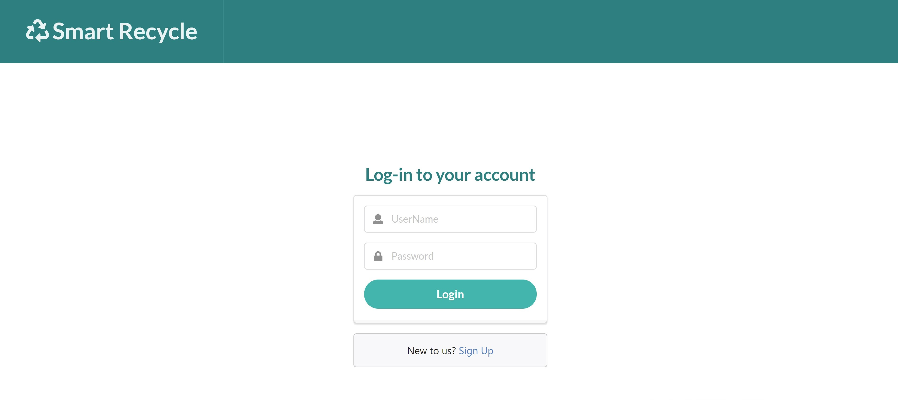
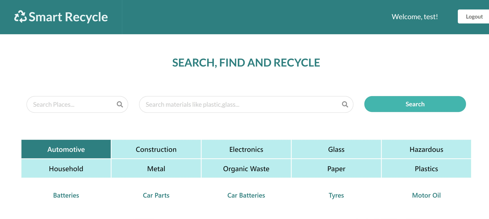
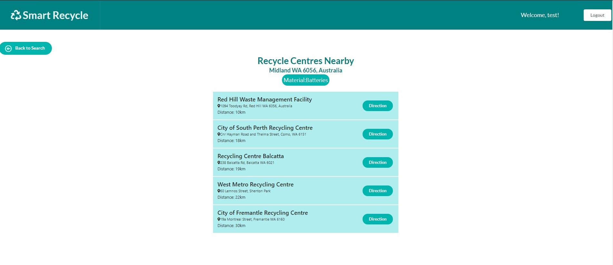

# SmartRecycle

## Description

SmartRecycle is a one stop solution for all your recycling problems. From household, electronics to construction waste, you can find the correct way and location to recycle them.

## Table of Contents

- [Usage](#usage)

- [License](#license)

- [Test](#tests)

- [Contribute](#contribute)

- [Questions](#questions)

## Application Deployed Link

[SmartRecycle](https://evening-brook-25132.herokuapp.com/)

## Screenshots

## Usage

Visit https://evening-brook-25132.herokuapp.com/ and create your account to get started

## License

This project is licensed under MIT license.

## Tests

Testing not available at the moment but feedback is much appreciated.

## Contribute

No contribution available at the moment.

## Questions

For any questions, please contact

- lochan.sharad@gmail.com

- [GitHub](https://github.com/best15)
